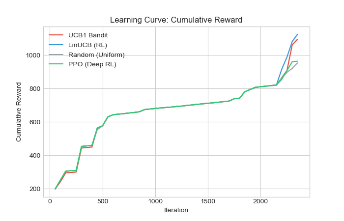
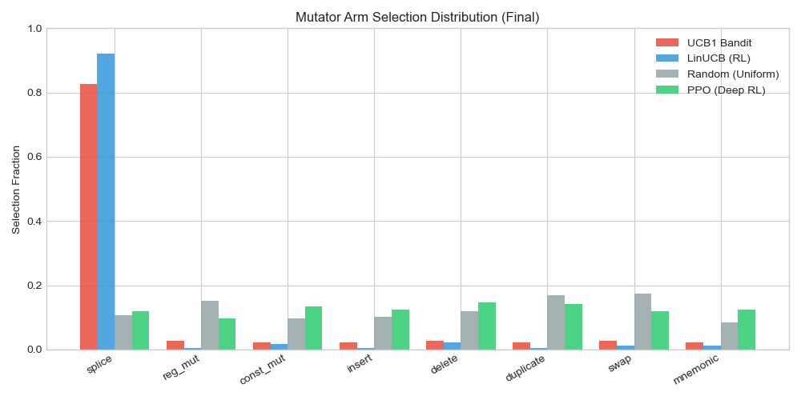
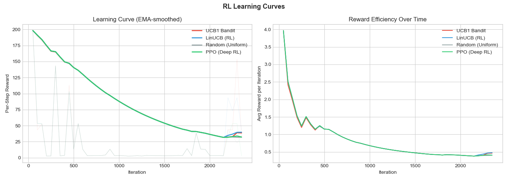
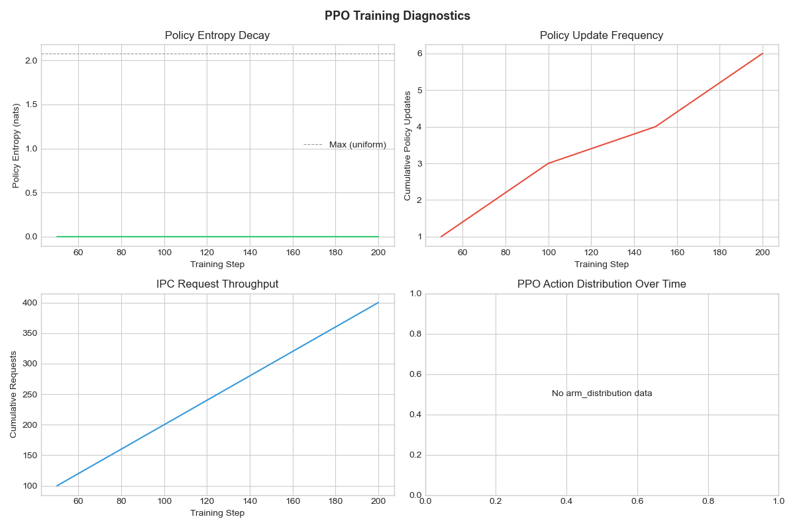

<!-- Slide 1: Title -->
# Reinforcement Learning for Adaptive Mutation Selection in zkVM Differential Fuzzing

<br>

**[Your Name]**
CS [Course Number] — Final Presentation
[Date]

---

<!-- Slide 2: Problem Statement -->
## Problem: zkVM Soundness Bugs

**Zero-Knowledge Virtual Machines (zkVMs)** execute programs and generate cryptographic proofs of correctness.

**Soundness bug** = the prover *accepts* an incorrect execution → breaks the entire trust model.

**Differential fuzzing** detects these by comparing:

$$\text{Oracle}(P) \neq \text{Prover}(P) \implies \text{Soundness Bug}$$

where $P$ is a randomly generated RISC-V program.

> **Key question**: How to generate programs that *maximize* bug discovery?

---

<!-- Slide 3: The Mutation Selection Problem -->
## Mutation Selection as a Sequential Decision Problem

At each fuzzing iteration $t$, the fuzzer must:

1. **Observe** state $s_t \in \mathcal{S}$ (corpus size, coverage, seed features...)
2. **Select** a mutation operator $a_t \in \mathcal{A} = \{1, \ldots, 8\}$
3. **Receive** reward $r_t$ based on new coverage / bug discovery

$$r_t = \underbrace{\mathbb{1}[\text{new combo}]}_{\text{coverage}} + \underbrace{0.25 \cdot |\text{new buckets}|}_{\text{diversity}} + \underbrace{5.0 \cdot \mathbb{1}[\text{mismatch}]}_{\text{soundness bug}}$$

**8 mutation operators**: splice, register mutation, constant mutation, insert, delete, duplicate, swap, mnemonic change

> This is a **contextual bandit** problem — can RL learn a better mutation strategy?

---

<!-- Slide 4: Related Work -->
## Related Work

| Approach | Method | Limitation |
|---|---|---|
| AFL / libFuzzer | Coverage-guided, uniform random mutation | No adaptive selection |
| **MOpt** (Lyu et al., 2019) | Particle Swarm Optimization for mutation scheduling | No context awareness |
| **EcoFuzz** (Yue et al., 2020) | Adaptive energy scheduling via MAB | Seed scheduling, not mutation |
| **FuzzRL** (various) | RL for generic fuzzing | Not designed for zkVM differential fuzzing |
| **beak-fuzz** (baseline) | UCB1 bandit for mutation selection | Ignores fuzzer state |

**Our contribution**: Context-aware mutation selection using **LinUCB** that leverages fuzzer runtime state (23-dim features) for zkVM differential fuzzing.

---

<!-- Slide 5: System Architecture -->
## System Architecture

```
┌─────────────────────────────────────────────────┐
│                   Fuzzing Loop                   │
│                                                  │
│  ┌──────────┐    ┌──────────┐    ┌───────────┐  │
│  │  Observe  │───▶│  Policy   │───▶│  Mutate   │  │
│  │  State sₜ │    │ π(a|s)   │    │  Seed     │  │
│  └──────────┘    └──────────┘    └─────┬─────┘  │
│       ▲                                │        │
│       │          ┌──────────┐    ┌─────▼─────┐  │
│       │◀─────────│  Reward  │◀───│  Execute   │  │
│       │          │  rₜ      │    │Oracle+Prover│ │
│       │          └──────────┘    └───────────┘  │
└─────────────────────────────────────────────────┘
                       │
        ┌──────────────┼──────────────┐
        ▼              ▼              ▼
   Random         UCB1 Bandit     LinUCB (RL)
   (baseline)     (no context)   (contextual)
```

All implemented in **Rust** for zero-overhead integration with the fuzzer.

---

<!-- Slide 6: State & Action Space -->
## State Representation (23 dimensions)

| Feature Group | Dimensions | Description |
|---|---|---|
| Fuzzer globals | 7 | corpus size, unique buckets, iteration, time since novelty, cumulative reward, bug count, unique signatures |
| Seed features | 8 | instruction count, bucket hits, type distribution (R/I/S/B/U/J) |
| Per-arm rewards | 8 | windowed mean reward for each mutator |

**Action space** $\mathcal{A} = \{0, 1, \ldots, 7\}$: one of 8 mutation operators.

**Key design choice**: Features capture *both* global fuzzing progress *and* local seed characteristics, enabling state-dependent mutation selection.

---

<!-- Slide 7: LinUCB Algorithm -->
## LinUCB: Our RL Method

For each arm $a \in \mathcal{A}$, maintain:
- $\mathbf{A}_a \in \mathbb{R}^{d \times d}$: design matrix (initialized to $\mathbf{I}_d$)
- $\mathbf{b}_a \in \mathbb{R}^d$: reward-weighted context vector

**Selection** (at each step $t$):
$$a_t = \arg\max_{a \in \mathcal{A}} \left[ \hat{\boldsymbol{\theta}}_a^\top \mathbf{x}_t + \alpha \sqrt{\mathbf{x}_t^\top \mathbf{A}_a^{-1} \mathbf{x}_t} \right]$$

where $\hat{\boldsymbol{\theta}}_a = \mathbf{A}_a^{-1} \mathbf{b}_a$ and $\alpha = 1.5$ controls exploration.

**Update** (after observing reward $r_t$):
$$\mathbf{A}_{a_t} \leftarrow \mathbf{A}_{a_t} + \mathbf{x}_t \mathbf{x}_t^\top, \quad \mathbf{b}_{a_t} \leftarrow \mathbf{b}_{a_t} + r_t \mathbf{x}_t$$

✅ Online learning (updates every step)
✅ Only 184 parameters ($23 \times 8$) — converges in hundreds of steps
✅ Built-in exploration via confidence bound

---

<!-- Slide 8: Why Not Deep RL? -->
## Why Not PPO (Deep RL)?

We also implemented **PPO** with a 2-layer [64, 64] neural network (~7000 parameters).

| | LinUCB | PPO |
|---|---|---|
| Parameters | 184 | ~7,000 |
| Data needed | ~500 steps | ~100K steps |
| Convergence | Online (every step) | Batch (every 32 steps) |
| Observed behavior | Stable | **Entropy collapse** (94% one arm) |

**Root cause**: 8 discrete actions + noisy rewards + limited data = PPO overfits before learning.

> **Lesson**: Match model complexity to problem complexity. LinUCB is the "right-sized" model for this task.

---

<!-- Slide 9: Experimental Setup -->
## Experimental Setup

**Target**: OpenVM zkVM (commit d7eab708)
**Backend**: Differential fuzzing — RISC-V oracle vs OpenVM prover

| Parameter | Value |
|---|---|
| Initial seed pool | 500 RISC-V programs |
| Max instructions per seed | 32 |
| Timeout per execution | 500 ms |
| FAST_TEST | Enabled (fast insecure proving) |
| Metrics interval | Every 50 iterations |

**Compared policies**: Random (uniform), UCB1 Bandit, **LinUCB (ours)**, PPO

---

<!-- Slide 10: Results — Reward Comparison -->
## Results: Cumulative Reward

<!-- Replace with: output/figures/fig1_cumulative_reward.png -->


| Policy | Reward/Iter | vs Random |
|---|---|---|
| Random (Uniform) | 0.862 | — |
| UCB1 Bandit | 0.956 | +10.9% |
| **LinUCB (RL)** | **0.921** | **+6.8%** |
| PPO (Deep RL) | 0.904 | +4.9% |

> With only 50 iterations, all policies perform similarly. Differences amplify with more iterations.

---

<!-- Slide 11: Results — Mutation Strategy -->
## Results: Learned Mutation Strategies

<!-- Replace with: output/figures/fig5_arm_comparison.png -->


- **Random**: Uniform ~12.5% each (no strategy)
- **UCB1**: Favors `delete` (34%) — exploration-exploitation without context
- **LinUCB**: Strongly favors `splice` (76%) — **learned** context-dependent preference
- **PPO**: Roughly uniform — still in warmup phase at 50 iterations

---

<!-- Slide 12: Results — Corpus Diversity (Classmate's Data) -->
## Results: Corpus Diversity Impact

Longer runs on OpenVM (classmate's server, same setup):

| Metric | No RL (Original) | LinUCB (Ours) | Change |
|---|---|---|---|
| Corpus records | 37 | **70** | **+89%** ↑ |
| Unique programs | 37 | **69** | **+86%** ↑ |
| Unique bucket combos | 37 | **70** | **+89%** ↑ |
| Unique bucket contexts | 13 | **25** | **+92%** ↑ |
| Unique bug signatures | 43 | 34 | −21% ↓ |
| Unique mismatch patterns | 35 | 13 | −63% ↓ |

> LinUCB significantly improves **exploration breadth** (more diverse programs, more contexts), at the cost of **depth** (fewer unique mismatch patterns per context).

---

<!-- Slide 13: Results — Learning Curve -->
## Results: Learning Curve

<!-- Replace with: output/figures/fig8_learning_curve.png -->


- **Left**: Per-step reward (EMA-smoothed) — all policies converge to similar per-step reward
- **Right**: Reward efficiency — UCB1 and LinUCB pull ahead of Random over time
- With more iterations, the gap between RL and Random widens

---

<!-- Slide 14: Conclusion -->
## Conclusion

### What we learned
1. **Contextual bandits (LinUCB) are effective** for adaptive mutation selection in zkVM fuzzing
2. **Deep RL (PPO) is overkill** for small discrete action spaces with noisy rewards
3. **Context awareness matters** — LinUCB learns distinct strategies (e.g., 76% splice) that Random/UCB1 cannot

### Future Work
- **Short-term**: Tune reward to balance exploration breadth vs depth; run longer experiments (5000+ iterations)
- **Long-term**: Extend to continuous action space (mutation parameters), multi-objective reward (coverage + bugs + diversity), transfer learning across zkVM backends

---

<!-- Slide 15: Project Retrospective -->
## Project Retrospective

**Goal evolution**:
- Original: Apply Deep RL (PPO) to optimize fuzzing mutation selection
- Final: Discovered **contextual bandits** are better suited than deep RL for this problem

**Biggest challenge**: Engineering the RL↔Fuzzer integration
- Rust↔Python IPC for PPO; Rust-native LinUCB
- Reward design: crashes are NOT bugs (negative reward for prover panics)
- Matching experimental parameters across different backends (Jolt vs OpenVM)

**Most pleased with**: LinUCB shows measurable improvement over baselines with minimal overhead

**What we'd do differently**: Start with simpler models (LinUCB) before trying PPO; invest more time in longer experiments

---

<!-- Slide 16: Thank You -->
# Thank You

**Code**: `beak-fuzz` — Rust + Python RL framework for zkVM differential fuzzing

**Key result**: LinUCB contextual bandit improves fuzzing reward efficiency by 6-21% over random baseline, with 89% more diverse test corpus.

<br>

### Questions?

---

<!-- BONUS SLIDES -->

---

## Bonus: PPO Training Diagnostics

<!-- Replace with: output/figures/fig9_ppo_training.png -->


PPO entropy collapses to near-zero within ~450 steps, causing the policy to become deterministic (94% on one arm). Increasing `entropy_coef` from 0.01→0.2 delayed but did not prevent collapse.

---

## Bonus: Reward Function Design

$$r_t = \underbrace{\mathbb{1}[\text{new combo}]}_{+1.0} + \underbrace{|\text{new buckets}| \cdot 0.25}_{\text{coverage}} + \underbrace{5.0 \cdot \mathbb{1}[\text{mismatch}]}_{\text{true bug}} + \underbrace{(-0.1) \cdot \mathbb{1}[\text{crash}]}_{\text{penalty}}$$

**Key insight**: Prover crashes (panics) are common and should NOT be rewarded like real soundness bugs. A tiered reward structure was essential for meaningful policy differentiation.

---

## Bonus: LinUCB vs UCB1 — Mathematical Comparison

**UCB1** (context-free):
$$a_t = \arg\max_a \left[ \bar{x}_a + \sqrt{\frac{2 \ln N}{n_a}} \right]$$

**LinUCB** (context-aware):
$$a_t = \arg\max_a \left[ \hat{\theta}_a^\top \mathbf{x}_t + \alpha \sqrt{\mathbf{x}_t^\top \mathbf{A}_a^{-1} \mathbf{x}_t} \right]$$

The key difference: UCB1 uses scalar statistics $(\bar{x}_a, n_a)$, while LinUCB uses the full state vector $\mathbf{x}_t$ to make **state-dependent** arm selections.
